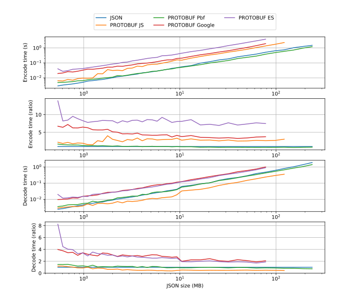
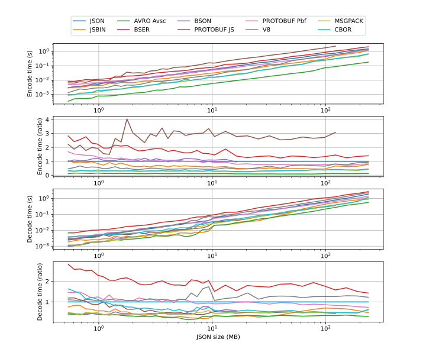
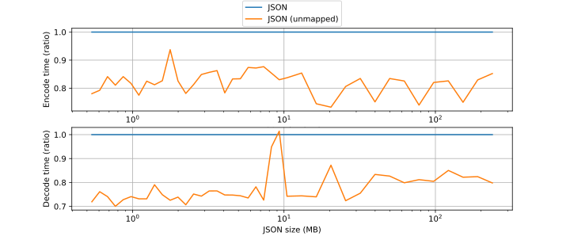
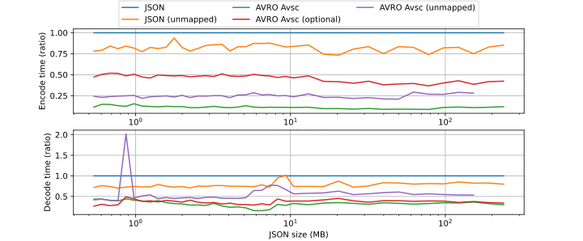
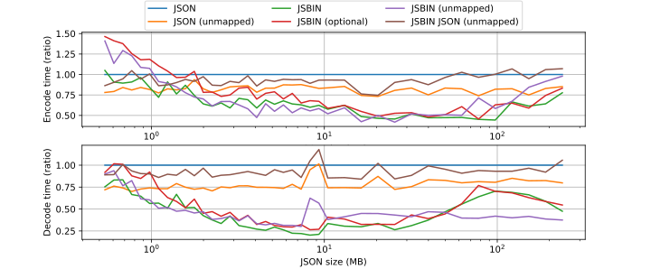
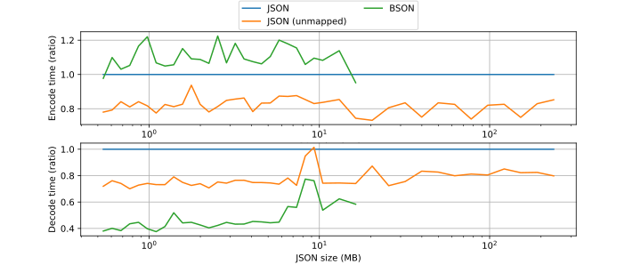
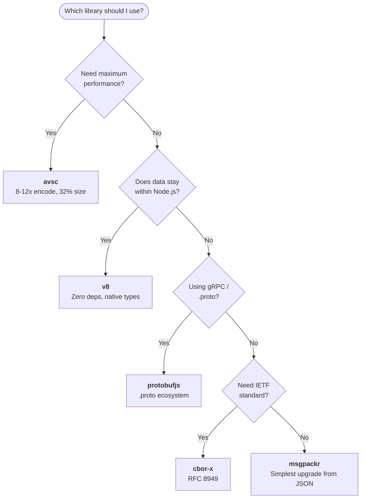

# Binary serialization comparison in JavaScript (Protocol Buffer, Avro, BSON, etc.)

This is a comparison and benchmark of various binary serialization formats and libraries used in JavaScript.

I was myself trying to decide what binary serialization format I should use in my personal projects, and what started out simple soon turned into a rather extensive comparison.

By sharing my findings, I hope it can be of help (and save time) to someone in a similar situation and perhaps inspire some developers to try out binary serialization.

## TL;DR (or Abstract)

This article and benchmark attempt to answer what binary serialization library to use with regard to performance, compression size and ease of use.

The following formats and libraries are compared:

* Protocol Buffer: `protobufjs`, `pbf`, `google-protobuf`, `@bufbuild/protobuf`
* Avro: `avsc`
* BSON: `bson`
* BSER: `bser`
* JSBinary: `js-binary`
* MessagePack: `msgpackr`
* CBOR: `cbor-x`
* V8 Serialization: `v8` (built-in)

**Quick recommendations:** For maximum performance, use `avsc`. For a schema-free drop-in JSON replacement, use `msgpackr`. See [Choosing a library](#choosing-a-library) for detailed guidance.

Based on the benchmark results in this article, the top libraries are ranked as follows (encode/decode values are x times faster than JSON, size is compared to JSON):

| # | Library | Encode | Decode | Size | Active |
|---|---------|--------|--------|------|--------|
| 1 | `avsc` | 8-12x | 3-7x | 32% | ✅ |
| 2 | `msgpackr` | 2-4x | 2-3x | 53% | ✅ |
| 3 | `cbor-x` | 2-4x | 1-2x | 53% | ✅ |
| 4 | `js-binary` | 1.5-2x | 1-5x | 32% | ⚠️ |
| 5 | `v8` | 1-2x | 0.6-1x | 61% | ✅ |
| 6 | `protobufjs` | 0.2-0.7x | 1-3x | 42% | ✅ |
| 7 | `pbf` | 0.8-1.4x | 0.7-1.4x | 42% | ✅ |
| 8 | `bson` | 0.8-1x | 1-3x | 79% | ✅ |
| 9 | `bser` | 0.5-0.8x | 0.5-0.8x | 67% | ⚠️ |

Due to various reasons outlined in the article, the author would not currently recommend the following libraries for performance-sensitive use:

* `google-protobuf`: 0.3-0.5x encoding, 0.8x decoding
* `@bufbuild/protobuf`: similar performance to `google-protobuf` (descriptor-based architecture)


Feel free to skip to the [Conclusion](#conclusion) for the summarized motivation, [Choosing a library](#choosing-a-library) for use-case recommendations, [Result (final)](#result-final) for performance graphs, or [Setup](#setup) to reproduce the measurements.


## Table of content

- [Introduction](#introduction)
- [Setup](#setup)
- [Disclaimer](#disclaimer)
- [Libraries](#libraries)
- [Benchmark](#benchmark)
- [Result (Protocol Buffers)](#result-protocol-buffers)
- [Result (final)](#result-final)
- [Result (extra)](#result-extra)
- [Conclusion](#conclusion)
- [Choosing a library](#choosing-a-library)
- [Changelog](#changelog)

## Introduction

Data serialization is common in most areas such as sending and receiving data over the network or storing/reading data from the file system. While JSON is a common modus operandi (especially in JavaScript), using a binary serialization format typically provides an advantage in compression size and performance at the cost of losing human readability of the encoded data.

Two common binary serialization formats across many programming languages are Protocol Buffers and Apache Avro. Avro is inherently a bit more compact than Protobuf, whereas Protobuf uses the additional data as field tags that could make it slightly more forgiving when changing the schema. For those interested, an excellent in-depth explanation has [already been written](https://martin.kleppmann.com/2012/12/05/schema-evolution-in-avro-protocol-buffers-thrift.html) by Martin Kleppmann.


In addition to this, several more recent JavaScript-oriented libraries will be included in the comparison.

This article will mostly focus on the performance aspect and provide a brief overview of each implementation, but as always, there will be pros and cons of each implementation that could be overlooked depending on your use-case.

## Setup

To reproduce the benchmark results, follow these steps.

* Install Node.js (v22 LTS or later recommended).
* Install dependencies:

```shell script
npm install
```
* Use the default configuration or modify `src/config.ts`.
* Select what libraries to test by changing `run-tests.sh` or use default that tests all libraries.
* Run `run-tests.sh` (if you are on Windows use Git BASH or similar):

```shell script
cd src
. run-tests.sh
```

* Create graph images (requires Python with matplotlib installed) by running:

```shell script
python plot.py
```

Graph settings can further be configured inside the script. Graph images are by default written to `img/`

Measurements are accumulated into `src/tmp/plot.json` each benchmark iteration. If needed, simply delete the file to reset the graph.

## Disclaimer

This article only focuses on measurements using JavaScript. Many of the measured formats support additional programming languages that could have different performance characteristics than indicated in this benchmark.

Although outside the scope of this article, compression size (and thereby network transfer speed) can be further improved at the cost of encoding/decoding performance by combining the output with a compressor/decompressor library such as `google/snappy` or `zlib`.

This is the first time I use many of the listed libraries and as such there might still be additional optimizations that I am unaware of. Still, I believe my implementation is a good indication to what most users will end up using.

Feel free to inspect my implementations in `src/benchmarks.ts`, and let me know if you find any glaring mistakes (or better yet by submitting a pull request).


## Libraries

The following libraries and versions are tested (sorted by NPM weekly downloads). Note that download numbers largely reflect transitive dependencies (e.g. `bser` is pulled in by React Native's Metro bundler, `protobufjs` by gRPC) rather than direct usage for serialization:

* `protobufjs "8.0.0"` - ~39M
* `bser "2.1.1"` - ~35M
* `bson "7.2.0"` - ~9M
* `@bufbuild/protobuf "2.11.0"` - ~8M
* `msgpackr "1.11.8"` - ~8M
* `pbf "3.3.0"` - ~4M
* `google-protobuf "4.0.1"` - ~3M
* `avsc "5.7.9"` - ~1M
* ~~`avro-js "1.12.1"` - ~58k~~
* `cbor-x "1.6.0"` - ~340k
* `js-binary "1.2.0"` - ~1k
* `v8` (built-in) - N/A

They are categorized as:

* Protocol Buffer: `protobufjs`, `pbf`, `google-protobuf`, `@bufbuild/protobuf`
* Avro: `avsc`, `avro-js`
* BSON: `bson`
* BSER: `bser`
* JSBinary: `js-binary`
* MessagePack: `msgpackr`
* CBOR: `cbor-x`
* V8 Serialization: `v8` (built-in)

Notable exclusion: [FlatBuffers](https://github.com/google/flatbuffers) is not included despite its popularity. FlatBuffers uses a zero-copy design where fields are accessed directly from the serialized buffer without a deserialization step, making it fundamentally different from the encode/decode pattern tested here.

`bser` is a binary serialization library developed for Facebook's "Watchman" filewatcher. Its high download count comes from being a transitive dependency of React Native's Metro bundler rather than direct adoption. It is mainly used for local IPC (inter process communication) as strings are represented as binary with no specific encoding.

`google-protobuf` is Google's official Protocol Buffer release, but `protobufjs` is by far the more popular library. Note that Protocol Buffers performs very well in compiled languages (C++, Go, Java). The much slower encoding in JavaScript is mostly an implementation issue, as the JS libraries are not as aggressively optimized for the V8 runtime as avsc is.

`avsc` seems to be the most popular Avro library. `avro-js` is an official release by the Apache Foundation but this was excluded from the result section as it seems to be based on an older version of `avsc`, contains fewer features and both libraries yielded very similar benchmark results with a slight advantage to `avsc`.

`bson` is the official JavaScript BSON library released by MongoDB. Its download count is largely driven by the MongoDB Node.js driver.

`js-binary` is the most obscure library (judging by weekly downloads) and uses a custom binary format that could make interoperability with other programming languages difficult, but this could also make it a good choice due to it being designed with JavaScript in mind. Note that the library has not been updated since 2017.

`@bufbuild/protobuf` (Protobuf-ES) is the modern TypeScript-first Protocol Buffer implementation by Buf. It requires code generation but returns plain objects (with a `$typeName` marker). It is rapidly growing in popularity as an alternative to both `google-protobuf` and `protobufjs`.

`msgpackr` is the fastest MessagePack implementation for JavaScript. MessagePack is a widely adopted schema-less binary format with implementations in most programming languages.

`cbor-x` is a fast CBOR (RFC 8949) implementation by the same author as `msgpackr`. CBOR is similar to MessagePack but backed by an IETF standard and used in WebAuthn/FIDO2.

`v8` is Node.js's built-in serialization module. It requires no dependencies and handles all JavaScript types natively, but the format is tied to the V8 engine and not suitable for cross-platform interchange.

## Benchmark

Each format will be compared against JavaScript's native JSON library as a baseline, regarding compression size and encoding/decoding time.

The data used in the benchmark is a growing array of tuples that is grown in increments of 1/8 of its previous size at each iteration, and (to speed things up) 1/4 when reaching sizes above 10 MB. In a real scenario it could be thought of as a list of vectors in a 2D or 3D space, such as a 3D-model or similarly data intensive object.

To further complicate things the first element of the tuple is an integer. This will give a slight edge to some serialization-formats as an integer can be represented more compactly in binary than as a floating-point number.

To all formats that support multiple datatype sizes; integers are encoded as a 32-bit signed integer and decimal numbers are encoded as 64-bit floating-point numbers.

The data is as follows:

```typescript
[
  [1, 4.0040000000000004, 1.0009999999999994],
  [2, 4.371033333333333, 0.36703333333333266],
  [3, 5.171833333333334, 0.4337666666666671],
  [4, 6.473133333333333, 0.36703333333333354],
  ...
]
```

The first challenge that arose is that not all measured serialization formats supports root level arrays, and almost none seem to support tuples, and as such the arrays first need to be mapped to structs as follows:

```typescript
{
  items: [
    {x: 1, y: 4.0040000000000004, z: 1.0009999999999994},
    {x: 2, y: 4.371033333333333, z: 0.36703333333333266},
    {x: 3, y: 5.171833333333334, z: 0.4337666666666671},
    {x: 4, y: 6.473133333333333, z: 0.36703333333333354},
    ...
  ]
}
```

This wrapped struct array is the final "payload" that is used in the benchmark unless specified otherwise. This further gives an advantage to some formats over JSON as duplicate information such as field names can be encoded more efficiently in a schema.

It should be noted that the time to convert the unmapped data to the mapped structs is excluded from all measurements in the benchmark.

### Precautions

Each appended element in the growing array is modified slightly so that all elements are unique.

It was discovered that some libraries can considerably impact the performance of other libraries when measured in the same running process, possibly due to memory reuse. To prevent this (and to get reproducible results) all measurements in the results section has been measured with each implementation running in an isolated Node.js process.

To reduce unpredictable stalls by the automatic garbage collector in Node.js, the garbage collector is forcefully triggered before each measurement. This did not have any discernable impact on the measured performance other than reducing some randomness.

Each payload size is measured once per run (no warm-up or averaging). Combined with process isolation and forced GC, the results have proven reproducible across runs.

### Unmapped data

Compared to the mapped (object with array of structs) data, the unmapped (array of arrays) data is more compact and contains less redundant information. As such additional performance could potentially be gained if the target application uses a similar representation internally.

This is investigated in an additional result section that is found after the main result section.

### Hardware

The current benchmark was done in Node.js v22.19.0 on 64-bit Linux (WSL2), with an AMD Ryzen 9 5950X CPU and 32 GB RAM. The original 2020 benchmark used Node.js v12.16.3 on Windows 10 with an Intel i7-4790K.

## Result (Protocol Buffers)

Protocol Buffer was tested more rigorously than the other formats and is thus given this dedicated section.

> **Note:** `protons` and `Protobuf (mixed)` were part of the original 2020 benchmark but have since been removed as `protons` underwent a complete rewrite (v1 to v7) with an incompatible API. Their analysis is preserved below for historical reference, but the performance graphs no longer include them.

All protobuf implementations in the test uses the following proto-file as schema.

```protobuf
syntax = "proto3";

message Item {
  int32 x  = 1;
  double y  = 2;
  double z  = 3;
}

message Items {
  repeated Item items = 1;
}
```

It should be noted that all fields in version "proto3" are optional by default, which could be an advantage feature-wise and disadvantage performance-wise as many of the other measured formats are mandatory by default.

### Performance graph



> This graph shows the encode/decode time of each implementation in seconds as well as ratio (compared to JSON) given the payload size in MB (measured as JSON). Note that a logarithmic scale is used on the `Encode/Decode time (s)` and `JSON size (MB)` axis.

During encoding, `pbf` performed closest to native JSON at 0.8-1.4x, while `protobufjs` and `google-protobuf` were 2-3 times slower.

During decoding, `protobufjs` performed the fastest at 1-3 times faster than native JSON. `pbf` performed similarly to JSON, while `google-protobuf` was slightly slower.

### Compression ratio

All implementations (`protobufjs`, `pbf`, `google-protobuf`) stayed consistent to the Protocol Buffer format and resulted in an identical compression ratio of 42% (compared to the corresponding file size of JSON) at all measured payload sizes.

### Maximum payload size

This is a ranking of the estimated maximum safe payload limit (measured as JSON) each library was able to process:

1. `pbf`: 372 MB
2. `JSON`: 298 MB
3. `protobufjs`: 153 MB
4. `google-protobuf`: 98 MB

 When exceeding the payload limit (given the default JavaScript heap size), a heap allocation error occurred in most cases.

### Negative effects during decoding

| |JSON|JS|Google|Protons (2020)|Pbf|mixed (2020)
|---|---|---|---|---|---|---
|Prototype pollution      | |x| |x| |x
|Getters/Setters| | | |x| | |
|Requires unwrapping| | |x| |
|Unexpected field renames| | |x| |

> This table shows an overview of negative effects during decoding.

`pbf` converts cleanly to JavaScript without any detected remnants from the encoding process.

`protobufjs` (which also affects `Protobuf (mixed)`) contains serialization remnants (such as type name) hidden in the prototype of the decoded objects, but should behave as a normal plain JavaScript object for most purposes.

`protons` should be usable as a data object but wraps all fields into getters/setters that could decrease performance.

`google-protobuf` is wrapped in a builder pattern and need to be converted before it can be used and can introduce unexpected field renames. It is however free from metadata after the final conversion.

It is as of now unknown if any of the polluted formats incur an additional overhead to plain objects as this is outside the current scope of this article, but it is something to keep in mind.

### Remarks

#### Protobuf (JS)

`protobufjs` is slow at encoding but fast at decoding.

During encoding it provided mixed result. At sizes below 1 MB it mostly performs better than the native JSON implementation, but at any larger sizes it performs 2 to 3 times worse.

It was the only implementation that reached its max payload limit of 153 MB during encoding, all other formats reached their limit at decoding. It was however discovered that it can decode payloads (created by other implementations) of greater sizes, up to 372 MB.

#### Protobuf (Pbf)

`pbf` is average at encoding and decoding, but is deserialized cleanly without added remnants.

By default `pbf` requires an extra build step where boilerplate code is generated from `.proto` file, though it seems to offer a few alternatives to streamline the process.

It is also the only Protobuf format that is converted cleanly to JavaScript, which could be a distinct advantage in some cases.

#### Protobuf (Google)

`google-protobuf` is slow at encoding, performs average during decoding but might require additional decoding that would further decrease performance, requires extra setup and can cause unexpected renaming of variables.

It does not seem to have an option for deserializing directly from JSON. Instead the following `Items` and `Item` classes are generated by the protocol buffer compiler that generates a Java-esque builder pattern that the data needs to be mapped into, as outlined here:

```typescript
...
const ItemsWrap = Schema.Items;
const ItemWrap = Schema.Item;
const itemsWrap = new ItemsWrap();
const itemWraps = data.items.map(item => {
  const itemWrap = new ItemWrap();
  itemWrap.setX(item.x);
  itemWrap.setY(item.y);
  itemWrap.setZ(item.z);
  return itemWrap;
});
itemsWrap.setItemsList(itemWraps);
return itemsWrap.serializeBinary();
```

This also unexpectedly renames our array from "items" into "itemsList" which can catch some people off guard and affect the receiving code, as this is not something that is present in other tested Protocol Buffers.

During decoding it performs slightly slower than native JSON. However, the deserialized data is still wrapped in the builder object which should be unsuitable for most purposes, and an additional call to ".toObject()" is required to fully convert it back to plain JavaScript, which would further decrease the performance and still includes the unexpected name change.

#### Protobuf (Protons)

`protons` is fast at encoding but very slow at decoding.

The decoded object has all fields wrapped into getters, which might be partially responsible for the poor decoding performance, and while serviceable, could cause some issues depending on how the decoded data is used. The easiest way to remove all getters/setters is to perform a JSON serialization/deserialization which will further increase decoding time.

It was only able to decode payloads of 47 MB in size, but opposite to `protobufjs` it can encode payloads of much greater size.

#### Protobuf (mixed)

`Protobuf (mixed)` is fast at both encoding and decoding and is good at handling large file sizes.

This implementation is simply a mix of `protobufjs` and `protons`, where `protons` is used for encoding and `protobufjs` for decoding. This resulted in the best overall performance of all protobuf implementations and can handle larger payloads than both formats can individually. While this might be too impromptu for most users, it gives us an estimate of how well either of these implementations could perform with some improvements.

> Note: The `protons` and `Protobuf (mixed)` analysis above reflects the original 2020 measurements.

#### Protobuf-ES (@bufbuild/protobuf)

`@bufbuild/protobuf` is the modern TypeScript-first Protocol Buffer implementation and is increasingly recommended as the successor to `google-protobuf`. It has a clean API, requires code generation, and returns plain objects (with a `$typeName` marker).

Despite being the newest implementation, it performed similarly to `google-protobuf` in benchmarks. This is due to its descriptor-based architecture where generated schema metadata is interpreted at runtime, rather than generating optimized encode/decode functions like `protobufjs` does.

### Further remarks

Due to poor results and to reduce redundancy, `protons`, `google-protobuf` and `@bufbuild/protobuf` will be excluded in further comparisons.

## Result (final)

This is the final comparison of the various formats.

### Performance graph



> This graph shows the encode/decode time of each implementation in seconds as well as ratio (compared to JSON) given the payload size in MB (measured as JSON). Note that a logarithmic scale is used on the `Encode/Decode time (s)` and `JSON size (MB)` axis.

During encoding `avsc` performed the fastest of all implementations (with good margin) at 8-12 times faster than native JSON, followed by `msgpackr` and `cbor-x` at 2-4 times faster, and `js-binary` at 1.5-2 times faster.

During decoding, `avsc` performed the fastest at 3-7 times faster than native JSON. `js-binary`, `msgpackr` and `bson` also decoded faster than JSON at 1.5-3 times. `bser` was the only library slower than JSON at decoding.

### Compression ratio

This is a ranking of the encoded size (compared to JSON) of each library:

1. `avsc`, `js-binary`: 32%
2. `protobufjs`, `pbf`: 42%
3. `msgpackr`, `cbor-x`: 53%
4. `v8`: 61%
5. `bser`: 67%
6. `bson`: 79%
7. `JSON`: 100%

### Maximum payload size

This is a ranking of the estimated maximum safe payload limit (measured as JSON) each library was able to process. Limits were determined by increasing payload size until a heap allocation error occurred (using the default Node.js heap size):

1. `avsc`, `js-binary`, `pbf`, `bser`, `v8`, `msgpackr`, `cbor-x`: 372 MB
2. `JSON`: 298 MB
3. `protobufjs`: 153 MB
4. `bson`: 21 MB

### Negative effects during decoding

| |Protobuf JS|BSON|JSBIN|AVRO|BSER|V8|MSGPACK|CBOR
|---|---|---|---|---|---|---|---|---
|Prototype pollution |x| | |x| | | |

> This table shows an overview of negative effects during decoding.

`bson`, `js-binary`, `bser`, `v8`, `msgpackr` and `cbor-x` all convert cleanly to JavaScript without any detected remnants from the encoding process.

`protobufjs` and `avsc` contain serialization remnants (such as type name) hidden in the prototype of the decoded objects, but should behave as normal plain JavaScript objects for most purposes.

### Remarks

#### AVRO (Avsc)

`avsc` has a more flexible schema definition than most other libraries. Normally an Avro schema is defined in JSON as in this example:

```typescript
// Type for "float[][]"
const type = avsc.Type.forSchema({
  "type": "array",
  "items": {
    "type": "array",
    "items": "float",
  }
});
type.schema(); // { "type": "array", ... }
```

But in `avsc` the same schema can be deferred from the data as:

```typescript
// Type for "float[][]"
const inferredType = avsc.Type.forValue([[0.5]]);
inferredType.schema(); // { "type": "array", ... }
```

Or as a more complex object:
```typescript
const AVSC_INT = 0;
const AVSC_FLOAT = 0.5;
const AVSC_DOUBLE = Infinity;

// Type for "{items: { x?: number, y?: number, z?: number}[]}"
const complexType = avsc.Type.forValue({
  items: [
    { x: AVSC_INT, y: AVSC_DOUBLE, z: AVSC_DOUBLE },
    { x: null, y: null, z: null },
  ]
});
```


#### JSBIN

Like `avsc` it also has a more succinct schema definition than most other implementations.

``` typescript
// Type for double[][]
// Note that all float types in js-binary is 64-bit
const type = new JsBin.Type([['float']]);

// Type for {x?: int, y?: double, z?: double}[]
const complexType = new JsBin.Type({
  items: [
    { 'x?': 'int', 'y?': 'float', 'z?': 'float' },
  ],
});
```

## Result (extra)

As mentioned in the Benchmark chapter the original data needed to be simplified to a more verbose format that was supported by all serialization formats. As the unmapped data is more compact and contains less redundant information, additional performance could potentially be gained if the target application uses a similar representation internally. This will be investigated for `avsc`, `js-binary`, `bson` in this section.

As none of the formats support tuples, the tuple will be encoded as a 64-bit float array which is expected to increase encoded size ratio slightly as the first field of the tuple can no longer be encoded as a 32-bit integer.

`avsc`, `js-binary` also has additional settings such as "optional fields", and `js-binary` has the datatype JSON that will be investigated with regards to performance.

### Performance graphs

#### JSON



> Performance graph of `JSON` with different settings.

| |JSON|JSON (unmapped)
|---|---|---
|Size ratio|1.00|0.77

Switching to unmapped data improved both encoding (1/4 faster) and decoding (1/3 faster). It also reduced size ratio to 0.77 of the original JSON.

#### AVRO Avsc



> Performance graph of `avsc` with different settings.

| |AVRO Avsc|AVRO Avsc (optional)|AVRO Avsc (unmapped)|
|---|---|---|---
|Size ratio|0.32|0.38|0.49
|Payload limit|372 MB|372 MB|237 MB

Making all fields `optional` did decrease performance somewhat from about 10x faster to 4x faster (though still faster than most other formats). It also increases size ratio slightly.

Switching to `unmapped` data also worsened performance similarly. One plausible explanation could be that the tuples are encoded as a dynamically sized array, which would make sense as the schema does not contain any information about the size of the tuple. However, performance is still good compared to other formats. Size ratio was also increased by 53% which is higher than expected as switching from 2 64-bit + 1 32-bit value to 3 64-bit values would only indicate a 20% increase.


#### JSBIN



> Performance graph of `js-binary` with different settings.

| |JSBIN|JSBIN (optional)|JSBIN (unmapped)|JSBIN JSON (unmapped)
|---|---|---|---|---
|Size ratio|0.32|0.38|0.48|0.77

Switching to `unmapped` had a slight improvement on encoding speed, but apart from this `optional` and `unmapped` had almost no impact on performance.

Increase in size ratio for both `optional` and `unmapped` is identical to `avsc`.

Encoding all data using the `js-binary` datatype `json` performed almost identically to `JSON (unmapped)` as well as size ratio. This seems to indicate that datatype `json` simply consists of using native JSON to create a string that is then stored as datatype `string` in `js-binary`.

#### BSON



> Performance graph of `bson` with different settings.

| |BSON|
|---|---|
|Size ratio|0.79|

The unmapped BSON test was excluded as the current version of the `bson` library does not support arrays as root input.

The encoded size ratio is relatively large compared to other formats at 79%.


## Conclusion

The libraries `js-binary`, `pbf`, `bser`, `bson`, `v8`, `msgpackr` and `cbor-x` all convert cleanly back to JavaScript without any detected remnants from the encoding process. `avsc` contained minor remnants. `google-protobuf` had major remnants.

`avsc` performed very well in all measurements, was easy to setup and seems to be the overall best performing serialization library. Switching from mandatory to optional fields slightly worsened performance and compression ratio, but still puts it on top. Performance was also slightly worse when processing small arrays compared to similar sized structs.

`js-binary` performed well in all measurements, was easy to setup and is deserialized cleanly. One disadvantage being that it uses a custom binary format that could make interoperability with other programming languages difficult. Switching from mandatory to optional fields had almost no impact on performance.

Regarding Protocol Buffer libraries it should be noted that all fields are optional by default in the latest schema version.

`protobufjs` was slow at encoding but fast at decoding (1-3x faster than JSON).

`pbf` performed similarly to native JSON at both encoding and decoding, but is deserialized cleanly without any remnants.

`bser` was slower than native JSON at both encoding and decoding. It was however very good at handling large payloads, and provides a good compression ratio considering it does not require a schema, and is deserialized cleanly.

`bson` performed similarly to native JSON at encoding but was notably faster at decoding (1-3x). It provided only a modest compression ratio and was bad at handling large payloads (21 MB limit), but does not require a schema and is deserialized cleanly.

`msgpackr` and `cbor-x` are schema-free alternatives that offer a good balance of performance, compression (53%) and ease of use. Both produce clean JavaScript objects and have implementations in most programming languages, making them practical choices when a schema is not desired. `cbor-x` has the additional advantage of being backed by an IETF standard (RFC 8949).

`v8` is Node.js's built-in serializer. It requires no dependencies and handles all JavaScript types natively, but the format is tied to the V8 engine and not suitable for cross-platform interchange.

`google-protobuf` was slow at encoding, performs average during decoding but might require additional decoding that would further decrease performance, requires extra setup and can cause unexpected renaming of variables.

## Choosing a library

Here are a few practical recommendations depending on your use case.



### Maximum throughput

If raw performance is the primary concern, `avsc` is the clear winner at 8-12x faster encoding and 3-7x faster decoding compared to JSON. It also achieves the best compression ratio (32%). The main trade-off is that Avro is less widely adopted than Protocol Buffers, and the decoded objects contain minor prototype pollution (which is harmless for most purposes).

`js-binary` is a strong runner-up with clean deserialization and a similarly compact format (32%), but uses a custom binary format with no cross-language support and has not been updated since 2018, which may be a concern for long-term maintenance.

### Cross-language interoperability

When data needs to be shared across different programming languages, **Protocol Buffers** (`protobufjs`) and **MessagePack** (`msgpackr`) are the strongest options.

`protobufjs` provides schema-enforced contracts via `.proto` files and has implementations in most languages. Encoding is slower than JSON at larger payloads, but decoding is 1-3x faster and the compression ratio (42%) is good.

`msgpackr` is schema-free, which makes it easier to adopt incrementally. It has implementations in most languages, offers 53% compression ratio and requires no code generation or schema definitions. If you need an IETF-standardized alternative, `cbor-x` (by the same author) offers similar performance with the backing of RFC 8949.

### Drop-in JSON replacement

If you want better performance without changing your data model or adding schemas, `msgpackr` and `cbor-x` are the simplest options. Both are schema-free, produce clean JavaScript objects on decode and require minimal setup:

```typescript
import { pack, unpack } from "msgpackr";
const encoded = pack(data);    // Buffer
const decoded = unpack(encoded); // plain object
```

### Node.js internal use

For data that stays within Node.js processes (caching, IPC, worker threads), the built-in `v8` serializer requires no dependencies and handles all JavaScript types natively, including `Map`, `Set`, `Date`, `RegExp` and typed arrays. The compression ratio (61%) is modest and the format is tied to the V8 engine, making it unsuitable for cross-platform interchange.

### Schema strictness

If schema enforcement and type safety matter (for example in API contracts), schema-based formats provide compile-time guarantees that schema-free formats cannot:

| Library | Schema format | Code generation |
|---------|--------------|-----------------|
| `protobufjs` | `.proto` files | Optional (reflection or static) |
| `@bufbuild/protobuf` | `.proto` files | Required |
| `avsc` | JSON or inferred from data | No |
| `js-binary` | Inline JavaScript | No |

For schema-free use where the data structure is implicit, `msgpackr`, `cbor-x`, `bson` and `v8` all work without any schema definition.

### Summary table

| Use case | Recommended | Why |
|----------|-------------|-----|
| Max performance | `avsc` | 8-12x encode, best compression |
| Cross-language with schema | `protobufjs` | Ubiquitous `.proto` ecosystem |
| Cross-language without schema | `msgpackr` | Simple API, wide language support |
| Drop-in JSON replacement | `msgpackr` / `cbor-x` | Schema-free, clean decode, easy setup |
| Node.js internal | `v8` | Zero dependencies, native type support |
| MongoDB ecosystem | `bson` | Required by MongoDB drivers |
| TypeScript-first Protobuf | `@bufbuild/protobuf` | Modern API, but slower than `protobufjs` |

## Changelog

### 2026

- Added V8 serialize, MessagePack (`msgpackr`), CBOR (`cbor-x`) and Protobuf-ES (`@bufbuild/protobuf`) to the benchmark
- Updated all dependencies to latest versions
- Removed `protons` (incompatible rewrite, v1 to v7) and `Protobuf (mixed)`
- `pbf` v4.0.1 was released with ESM-only support and native DataView (potential float performance improvement) but was not tested due to breaking API changes

### 2020-07-28

- Initial release
